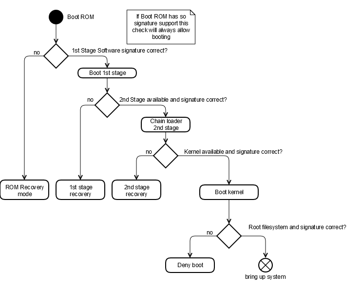

==============
System Startup
==============

.. :Author: Sebastian Döll <sdoell@hilscher.com>

The following chapter gives an overview about the generic boot process which will be valid on all platforms running the netFIELD OS. The boot process will guarantee a safe runtime for netFIELD OS. For details or platform specific extensions refer to specific chapter under :doc:`Platform Specifics<../../../platforms/index>`.

Overview
========

Kernel / Initramfs
==================

**NOTE:** Kernel images must contain a so called initramfs image, which takes over the security critical path and is included in signature check

The kernel image consists of the kernel binary and an additional initramfs image, that continues the boot process

The following steps are performed in order
 #. Platform initialization (detect plugged modules, initialized external I/Os, etc.)
 #. Load special kernel module, providing platform certificate (for verification)
 #. Run initrd-api, which is a special signed script that can be run during power up
 #. Perform maintenance operations when requested via parameter (Factory Reset, Production process, Backup/Restore, ...)
 #. Select/verify kernel and options to boot (boot.cfg passed by kernel command line). This also checks the signature of the root filesystem (brought as signed squashfs image)
 #. Install signed device-label (bound to hardware via MAC address of first interface) into a kernel driver (sysfs) for unique / platform specific data
 #. Mount writable directories as overlays
 #. Hand over operation to roofs and continue booting

System
======

During system runtime no additional checks are performed and systemd takes over the boot process.
